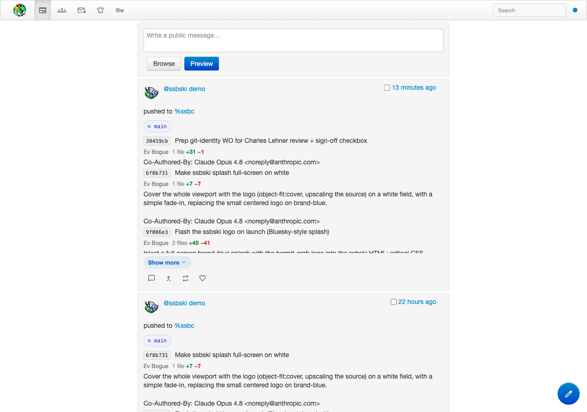
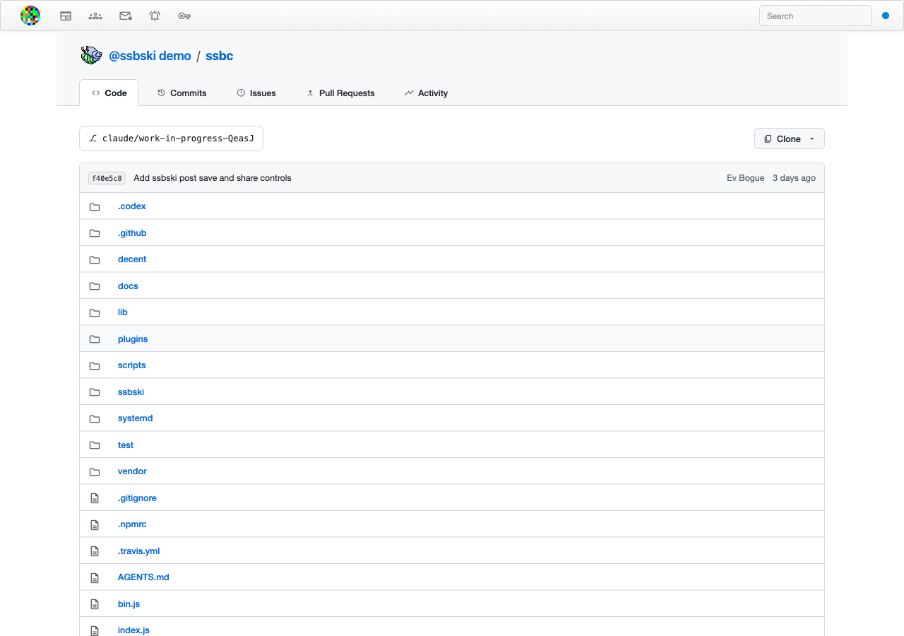
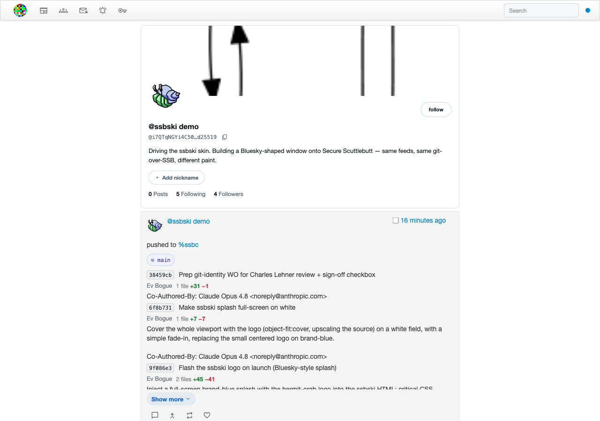

# Secure-Scuttlebot Classic

Secure Scuttlebutt is a peer-to-peer protocol built on signed, append-only personal logs.
Your feed lives on your own computer. Messages gossip between nodes over the network.
There is no central server and no algorithmic feed.

`ssbc` keeps alive what Dominic Tarr, Paul Frazee, Charles Lehner, and Everett Bogue built.
Dominic designed the SSB protocol, wrote scuttlebot — the server at the heart of this repo —
and originated Patchbay; Paul created Patchwork, the original SSB desktop client; Charles built
git-ssb; and Everett forked Patchbay into Decent in 2016. The project was abandoned in 2024.
This is the continuation.

Try it before installing — same node, same network, two different interfaces:
[decent.evbogue.com](https://decent.evbogue.com/) (the classic Decent client) or
[ssbski.evbogue.com](https://ssbski.evbogue.com/) (ssbski, a Bluesky-style skin).



---

## What you can do

- Post and read a social feed stored on your own computer
- Follow people and build a social graph that syncs across peers
- Send end-to-end encrypted private messages
- Share files through the network
- Host git repositories on your SSB node — no GitHub required
- Connect to the wider network through pubs (always-on public nodes)

---

## Requirements

- **Node.js ≥ 22.5** (uses `node:sqlite` built-in)
- `npm`
- `git` on `PATH` (required for the git smart HTTP server)

---

## Installation

```bash
git clone https://github.com/evbogue/ssbc.git
cd ssbc
npm install
```

---

## Getting Started

### 1. Start the Server

```bash
npm start
# equivalent to: node bin.js start
```

Output:
```
ssb-server <version> <path> logging.level:<level>
my key ID: <@yourPublicKey>
Decent launched at http://127.0.0.1:8989/
```

Leave this terminal open. Run all other commands in a **separate terminal**.

### 2. Open Decent

With the server running, open **http://127.0.0.1:8989/** in your browser. That's it.

### 3. Explore the CLI (optional)

```bash
node bin.js whoami          # your public key
node bin.js gossip.peers    # connected peers
node bin.js help            # list all commands
node bin.js help <command>  # detail on a specific command
```

---

## Pubs, gossip, and replication

Secure Scuttlebutt is a gossip protocol. When two nodes connect, they compare what each has and exchange what the other is missing — no central server decides what gets shared or in what order. Follow enough people and their messages find their way to you through the network, peer to peer.

The thing being replicated is an append-only log. Every message you publish is signed with your private key and references the previous message in your feed, forming a cryptographic chain. You cannot insert, delete, or modify a past message without breaking the chain. Anyone who has your feed can verify every message in it. No one can forge your identity or rewrite your history.

This is what makes SSB different from federated or centralized networks. Your feed is yours — it exists on every node that has replicated it. Even if this server goes offline, your messages survive on your followers' nodes.

A **pub** is an always-on SSB node with a public IP address. Pubs exist to help nodes find each other — when you accept a pub invite, the pub follows you and you follow it back, and your node uses that connection to exchange messages with the broader network. Pubs do not control the network. They are just well-connected peers that happen to stay online. If a pub disappears, your feed and your social graph survive on every node that has them.

If you are running a pub and want to connect nodes, you can issue and accept invites from the CLI:

```bash
node bin.js invite.create 1          # single-use invite
node bin.js invite.accept "CODE"     # accept an invite from another pub
```

`decent.evbogue.com` is one public node running on the network.

---

## Git over SSB

Your git repositories live in your SSB log. Anyone who follows you can clone them.
No GitHub, no GitLab, no server to admin — just your node and the network.



### Create a repo

```bash
node bin.js git.create my-project
# → "http://127.0.0.1:8989/git/%25<id>.sha256"
```

### Use it as a git remote

```bash
git remote add ssb http://127.0.0.1:8989/git/%25<id>.sha256
git push ssb main
git clone http://127.0.0.1:8989/git/%25<id>.sha256
```

Standard git operations (push, fetch, clone, branches) all work against this remote. The repo URL contains the SSB message ID of the `git-repo` message — share it with others on the network and they can clone it once it has replicated to their node.

Decent includes a git-forge UI for browsing repos, branches, and commits in the browser.

---

## Web UI: Decent and ssbski



The browser UI ships in two skins, both built from `decent/`:

- **Decent** — the classic Patchbay-derived client, served by `plugins/decent-ui.js`.
  Decent and the WebSocket transport share a single port — defaulting to `8989`.
  Public instance: [decent.evbogue.com](https://decent.evbogue.com/).
- **ssbski** — a Bluesky-style skin served by `plugins/ssbski-ui.js` on its own port
  (default `8990`), with Discover/Following feed tabs, a trending sidebar, and a sticky
  centre-column header. Public instance: [ssbski.evbogue.com](https://ssbski.evbogue.com/).

Both skins are the **same JavaScript bundle** talking to the **same local SSB node** — only
the stylesheet differs (`style.css` for Decent, `ssbski-style.css` for ssbski). When you run
`npm start`, both are served at once: open `http://127.0.0.1:8989/` for Decent or
`http://127.0.0.1:8990/` for ssbski. Pick whichever interface you prefer; they read and write
the same feed.

### Rebuilding the frontend

The built frontend is committed to the repo — you do not need to rebuild it to run `ssbc`. If you are making changes to the source in `decent/`, rebuild with:

```bash
npm run build:web
```

This rebuilds the shared JS bundle and **both** stylesheets in one step.

Build output: `decent/build/index.html`, `decent/build/style.css`, `decent/build/ssbski-style.css`

### Local docs

Archived Scuttlebot documentation is also served at:

- **http://127.0.0.1:8989/docs**

Those docs are served from `docs/scuttlebot.io/`. Their vendored source lives in
`vendor/scuttlebot.io/`, and you can resync generated output with:

```bash
npm run sync:scuttlebot-docs
```

To run on a different port, pass `--ws.port` after `--` — Decent and the WebSocket share it:

```bash
node bin.js start -- --ws.port 8888
```

Or set it permanently in `~/.ssb/config`:

```json
{
  "ws": {
    "port": 8888
  }
}
```

---

## Architecture

`ssbc` is a SQLite-backed message store connected to a secret-stack RPC surface, with a WebSocket bridge for browser clients, a git-over-HTTP plugin, and the Decent and ssbski frontends served from the same node. The pieces are documented separately:

- [`docs/overview.md`](docs/overview.md) — what the pieces are
- [`docs/architecture.md`](docs/architecture.md) — how they fit together
- [`docs/api.md`](docs/api.md) — RPC surface and message shapes
- [`docs/cli.md`](docs/cli.md) — full command reference
- [`docs/frontend.md`](docs/frontend.md) — Decent and ssbski frontend internals
- [`docs/http-replication.md`](docs/http-replication.md) — replication protocol

Archived scuttlebot reference docs are served locally at `http://127.0.0.1:8989/docs` but `docs/` is the primary source of truth for how this repo works now.

---

## What changed from classic scuttlebot

- `node:sqlite` replaces flume and all native dependencies — no more build failures on modern Node
- Message storage is SQLite-backed; the flume indexes are gone
- HTTP replication is available alongside the classic muxrpc transport
- The `sbot` / `ssb-server` CLI and most classic plugin commands are preserved

---

## Contributing and license

See [`AGENTS.md`](AGENTS.md) for development conventions.

MIT
