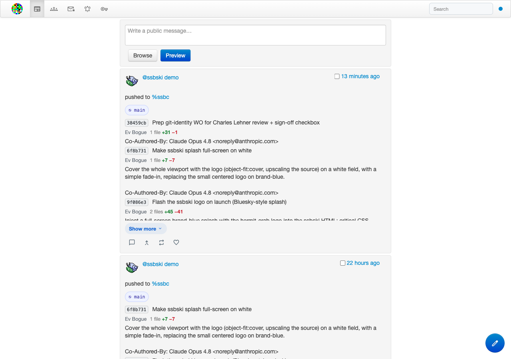
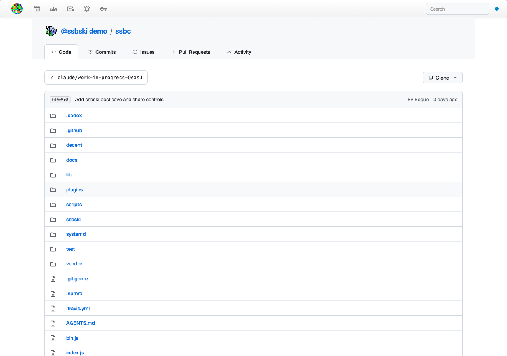
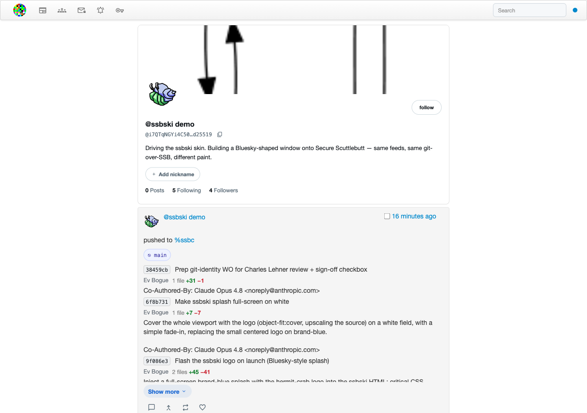
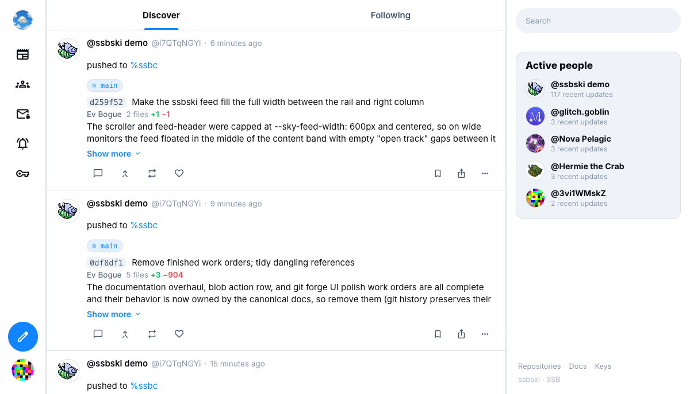

# Secure-Scuttlebot Classic

Secure Scuttlebutt is a peer-to-peer protocol built on signed, append-only personal logs.
Your feed lives on your own computer. Messages gossip between nodes over the network.
There is no central server and no algorithmic feed.

`ssbc` keeps alive what Dominic Tarr, Paul Frazee, Charles Lehner, and Everett Bogue built.
Dominic designed the SSB protocol, wrote scuttlebot — the server at the heart of this repo —
and originated Patchbay; Paul created Patchwork, the original SSB desktop client; Charles built
git-ssb; and Everett forked Patchbay into Decent in 2016. The project was abandoned in 2024.
This is the continuation.

Try it before installing: [ssb.evbogue.com](https://ssb.evbogue.com/) is the public
Decent node, with live-switchable skins in the browser.



---

## What you can do

- Post and read a social feed stored on your own computer
- Follow people and build a social graph that syncs across peers
- Send end-to-end encrypted private messages
- Share files through the network
- Host git repositories on your SSB node — no GitHub required
- Connect to the wider network through pubs (always-on public nodes)

---

## Requirements

- **Node.js ≥ 22.5** (uses `node:sqlite` built-in)
- `npm`
- `git` on `PATH` (required for the git smart HTTP server)

---

## Installation

```bash
git clone https://github.com/evbogue/ssbc.git
cd ssbc
npm install
npm run build:web   # build the web UI bundle (not committed to the repo)
```

The web UI bundle in `decent/build/` is generated, not checked in, so build it once
after installing (and again whenever you change the frontend source in `decent/`).

---

## Getting Started

### 1. Start the Server

```bash
npm start
# equivalent to: node bin.js start
```

Output:
```
ssbc <version> <path> logging.level:<level>
my key ID: <yourPublicKey>
Decent launched at http://127.0.0.1:8989/
```

Leave this terminal open. Run all other commands in a **separate terminal**.

### 2. Open Decent

With the server running, open **http://127.0.0.1:8989/** in your browser. That's it.

### 3. Explore the CLI (optional)

```bash
node bin.js whoami          # your public key
node bin.js gossip.peers    # connected peers
node bin.js help            # list all commands
node bin.js help <command>  # detail on a specific command
```

---

## Pubs, gossip, and replication

Secure Scuttlebutt is a gossip protocol. When two nodes connect, they compare what each has and exchange what the other is missing — no central server decides what gets shared or in what order. Follow enough people and their messages find their way to you through the network, peer to peer.

The thing being replicated is an append-only log. Every message you publish is signed with your private key and references the previous message in your feed, forming a cryptographic chain. You cannot insert, delete, or modify a past message without breaking the chain. Anyone who has your feed can verify every message in it. No one can forge your identity or rewrite your history.

This is what makes SSB different from federated or centralized networks. Your feed is yours — it exists on every node that has replicated it. Even if this server goes offline, your messages survive on your followers' nodes.

A **pub** is an always-on SSB node with a public IP address. Pubs exist to help nodes find each other — when you accept a pub invite, the pub follows you and you follow it back, and your node uses that connection to exchange messages with the broader network. Pubs do not control the network. They are just well-connected peers that happen to stay online. If a pub disappears, your feed and your social graph survive on every node that has them.

If you are running a pub and want to connect nodes, you can issue and accept invites from the CLI:

```bash
node bin.js invite.create 1          # single-use invite
node bin.js invite.accept "CODE"     # accept an invite from another pub
```

`ssb.evbogue.com` is one public node running on the network.

---

## Git over SSB

Your git repositories live in your SSB log. Anyone who follows you can clone them.
No GitHub, no GitLab, no server to admin — just your node and the network.



### Create a repo

```bash
node bin.js git.create my-project
# → "http://127.0.0.1:8989/git/%25<id>.sha256"
```

### Use it as a git remote

```bash
git remote add ssb http://127.0.0.1:8989/git/%25<id>.sha256
git push ssb main
git clone http://127.0.0.1:8989/git/%25<id>.sha256
```

Standard git operations (push, fetch, clone, branches) all work against this remote. The repo URL contains the SSB message ID of the `git-repo` message — share it with others on the network and they can clone it once it has replicated to their node.

Decent includes a git-forge UI for browsing repos, branches, and commits in the browser.

---

## Web UI: Decent and Its Skins



The browser UI is Decent: one shared app built from `decent/`, talking to one local SSB
node. It ships with three live-switchable modern skins:

- **decent2** — the default Decent skin, a modernized take on the classic client.
- **ssbski** — a Bluesky-style skin alias served by `plugins/ssbski-ui.js` on its own port
  (default `8990`), with Public/Friends feed tabs, a trending sidebar, and a sticky
  centre-column header.
- **ssbpro** — a professional-network skin alias served by `plugins/ssbpro-ui.js` on its own
  port (default `8991`), with Feed/Network tabs, profile-forward cards, and a right
  discovery column.

The main Decent entry point is served by `plugins/decent-ui.js`, defaults to `decent2`,
and is normally available at `http://127.0.0.1:8989/`. Public instance:
[ssb.evbogue.com](https://ssb.evbogue.com/).



All modern skins are the **same JavaScript bundle** talking to the **same local SSB node**.
Only the stylesheet/default skin differs (`decent2-style.css`, `ssbski-style.css`, or
`ssbpro-style.css`), and the app can switch among them live from Themes. When you run
`npm start`, open `http://127.0.0.1:8989/` for Decent; the old skin-specific ports remain
as compatibility aliases.

### Rebuilding the frontend

The web UI bundle (`decent/build/`) is generated and **not** committed to the repo, so you build it once during installation. Rebuild it whenever you change the source in `decent/`:

```bash
npm run build:web
```

This rebuilds the shared JS bundle and all stylesheets in one step.

Build output: `decent/build/index.html`, `decent/build/base.css`,
`decent/build/decent2-style.css`, `decent/build/ssbski-style.css`,
`decent/build/ssbpro-style.css`, plus the historical `decent/build/style.css`.

### Deploying to a public node

The public node (`decent.evbogue.com`, etc.) runs `node bin start` inside a tmux
session. Because `decent/build/` is **not** committed, `git pull` alone never
updates the served app — you must rebuild the bundle on the server and restart the
process. Full deploy:

```bash
ssh root@evbogue.com
cd /root/ssbc
git pull
npm install                # deps the pull may have added — see the warning below
npm run build:web          # REQUIRED — build/ is gitignored, pull won't update it
ls -la decent/build/index.html   # ~3.2 MB = good; ~1 KB = the build failed
```

> **`npm run build:web` can fail and still report success.** It pipes browserify
> into indexhtmlify; if browserify errors, the pipe's exit status comes from
> indexhtmlify, which happily wraps an empty stream and writes a ~1 KB
> `index.html` — valid HTML, empty `<script>`, no app. This has taken the public
> node down. The usual trigger is a dependency added since the last deploy, hence
> the `npm install`: `git pull` never updates `node_modules`. **Always check the
> file size before restarting.**

Then restart the running node. It lives in tmux session `7` (find it with
`tmux list-panes -a -F '#{session_name} #{pane_current_command} #{pane_current_path}'`):

```bash
tmux send-keys -t 7 C-c           # stop the current node
tmux send-keys -t 7 'node bin start' Enter
```

Verify the live bundle picked up your change, e.g.:

```bash
curl -s http://127.0.0.1:8989/ | grep -c 'some-string-from-your-change'
```

### Public hostnames

TLS and routing on the node are handled by a small Deno reverse proxy in
`/root/reverse-proxy`, run by `reverse-proxy.service`. It maps hostname → local
port from `domains.json`, and it loads **one** certificate:
`/etc/letsencrypt/live/wiredove.net/`. A hostname needs an entry in both places —
missing from `domains.json` it 404s, missing from the cert it fails TLS.

The public SSB web app is consolidated at `ssb.evbogue.com`. Old SSB web hostnames such
as `decent.evbogue.com`, `ssbski.evbogue.com`, `ssbpro.evbogue.com`, and
`decent2.evbogue.com` redirect to `https://ssb.evbogue.com`; do not add new public
hostnames for skins. DNS is already a wildcard `A` record, so non-SSB subdomains resolve
without touching Namecheap. Two steps, then a restart:

```bash
# 1. route it (back the file up first — the directory keeps .bak copies)
cd /root/reverse-proxy
cp domains.json domains.json.bak-$(date +%s)
# add e.g.  "example.evbogue.com": 8123

# 2. add it to the cert. --expand rewrites the SAN list, so pass EVERY existing
#    name plus the new one, or the others drop off and break.
certbot certificates                      # copy the current Domains: list
systemctl stop http-redirect.service      # certbot --standalone needs :80
certbot certonly --standalone --cert-name wiredove.net --expand \
  --non-interactive --agree-tos \
  -d wiredove.net -d <...every existing name...> -d newname.evbogue.com
systemctl start http-redirect.service

# 3. the proxy reads the cert once at startup
systemctl restart reverse-proxy.service
```

Then check the new name *and* a couple of existing ones — `--expand` mistakes
show up as TLS failures on the names you forgot to pass.

> **Don't start the proxy by hand.** `serve.js` reads the certificate at startup,
> and certbot's deploy hook renews it by restarting `reverse-proxy.service`. A
> hand-started copy holding `:443` makes the systemd unit crash-loop on "address
> in use", and renewals then never reach the process actually serving traffic —
> it keeps presenting the old cert until someone notices. Use `systemctl`.

Wildcard certs would remove the `--expand` dance, but `*.evbogue.com` requires
DNS-01 validation and so an API credential for the DNS provider; Namecheap gates
API access behind account criteria. Expanding the SAN list is the deliberate
trade-off for now.

### Local docs

The running server serves this repository's current documentation at:

- **http://127.0.0.1:8989/docs**

That index links the canonical pages (overview, architecture, API, the generated
API reference, CLI, frontend, and documentation maintenance), each rendered from
the Markdown in `docs/`.

The original Scuttlebot manual is kept as a clearly labelled historical archive at:

- **http://127.0.0.1:8989/docs/archive**

The archive is served from `docs/scuttlebot.io/`. Its vendored source lives in
`vendor/scuttlebot.io/`, and you can resync generated output with:

```bash
npm run sync:scuttlebot-docs
```

To run on a different port, pass `--ws.port` after `--` — Decent and the WebSocket share it:

```bash
node bin.js start -- --ws.port 8888
```

Or set it permanently in `~/.ssb/config`:

```json
{
  "ws": {
    "port": 8888
  }
}
```

---

## Architecture

`ssbc` is a SQLite-backed message store connected to a secret-stack RPC surface, with a WebSocket bridge for browser clients, a git-over-HTTP plugin, and Decent served from the same node. The pieces are documented separately:

- [`docs/overview.md`](docs/overview.md) — what the pieces are
- [`docs/architecture.md`](docs/architecture.md) — how they fit together
- [`docs/api.md`](docs/api.md) — RPC surface and message shapes
- [`docs/api-reference.md`](docs/api-reference.md) — generated reference of every built-in RPC method
- [`docs/cli.md`](docs/cli.md) — full command reference
- [`docs/frontend.md`](docs/frontend.md) — Decent frontend and skin internals
- [`docs/docs-maintenance.md`](docs/docs-maintenance.md) — how the docs are organized, served, and kept accurate

These current-behavior docs are also served by the running server at
`http://127.0.0.1:8989/docs`. The historical Scuttlebot manual lives at
`http://127.0.0.1:8989/docs/archive`.

---

## What changed from classic scuttlebot

- `node:sqlite` replaces flume and all native dependencies — no more build failures on modern Node
- Message storage is SQLite-backed; the flume indexes are gone
- A WebSocket bridge and git-over-HTTP run alongside the classic muxrpc transport (feed replication still rides muxrpc/EBT)
- The `sbot` / `ssb-server` CLI and most classic plugin commands are preserved

---

## Contributing and license

See [`AGENTS.md`](AGENTS.md) for development conventions.

MIT
